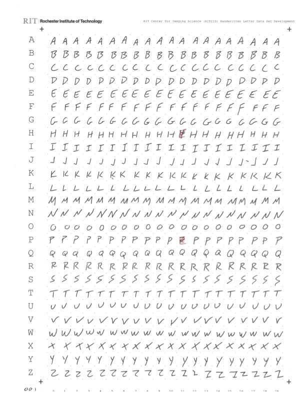

# RITCIS Database of Handwritten Letters

The [MNIST database of handwritten digits](http://yann.lecun.com/exdb/mnist/) has long been a standard data set for training and testing machine learning architectures aimed at the classification problem.

The **RITCIS database of handwritten letters** (uppercase) has been developed to serve this same purpose.  This database has been created using samples prepared by students, staff, and faculty at the [Rochester Institute of Technology](https://www.rit.edu)'s [Chester F. Carlson Center for Imaging Science](https://www.rit.edu/science/chester-f-carlson-center-imaging-science) as part of the course titled *Image Processing and Computer Vision* (IMGS.361) [Fall Semester of AY2023-2024].

A sample handwritten letters form used to collect the samples for the RITCIS database is shown below:

    

To date, 109 forms have been prepared and used to create the current instantiation of the database.  This instantiation is split into 39,521 training images and 7,905 test images.

The format of the training/test images and labels files, located in the `datasets` directory above, are identical to those used for the MNIST database files.  Data readers designed for reading MNIST database files should work identically on the RITCIS database files.

The compressed database files located in `datasets` are named as 

    test-images-028-ubyte.gz
    test-labels-028-ubyte.gz
    train-images-028-ubyte.gz
    train-labels-028-ubyte.gz

where the `028` represents the square dimension of the images (28x28 pixels in this example).  Square-dimensioned versions of the data are provided at 28, 56, 112, and 224 pixels.  Be sure to decompress these database files prior to use on your system.

## Data Preparation

The handwritten letters (paper/physical) forms (located in the [sample/ppt](https://github.com/csalvaggio/ritcis/tree/main/samples/ppt) directory) were filled out by students, staff, and faculty at the [Rochester Institute of Technology](https://www.rit.edu).  Forms were scanned utilizing a Xerox AltaLink B8170.  The following modifications were made to the default scan preferences:

* Output Color: Color
* Resolution: 600 dpi
* Quality/File Size: Lowest Compression / Largest File Size

The PDFs generated from the scans are located in the samples/pdf directory.  Each PDF contains 10 scanned forms.

#### extract_tiles.py

<pre>
usage: extract_tiles.py [-h] [-d TILES_BASE_DIRECTORY] [-c] [-o] [-s]
                        [-r STRUCTURING_ELEMENT_RADIUS]
                        [-t ABSOLUTE_TOLERANCE]
                        starting_sample pdf_filename

Extract tiles from handwritten letter data set development sheets

positional arguments:
  starting_sample       starting sample ID number
  pdf_filename          file path of the PDF containing the scanned
                        handwritten letter data set development sheets

options:
  -h, --help            show this help message and exit
  -d TILES_BASE_DIRECTORY, --tiles-base-directory TILES_BASE_DIRECTORY
                        base directory for extracted letter tiles [default is
                        None]
  -c, --use-centroid    the letters will be centered using its centroid value,
                        otherwise the letter's bounding box center will be
                        used [default is False]
  -o, --use-original-dimensions
                        the letters will retain their original dimensions,
                        otherwise they will be size normalized while retaining
                        their original aspect ratio [default is False]
  -s, --square          create square tiles [default is False]
  -r STRUCTURING_ELEMENT_RADIUS, --radius STRUCTURING_ELEMENT_RADIUS
                        structuring element radius to use for character
                        cleanup using morphological closings/openings [default
                        is 3]
  -t ABSOLUTE_TOLERANCE, --tolerance ABSOLUTE_TOLERANCE
                        absolute tolerance for determining if channel
                        probability density functions are different [default
                        is 0.025]
</pre>

This script performs the extraction of an individual tile for each handwritten letter on the handwritten letter forms.

Each page of the provided PDF file is converted to an image at a resolution of 600 dpi.  Each page's image is aligned to a fixed grid using the fiducials located in the four (4) corners of the form and a quad-to-quad perspective mapping function.  This allows for the individual letter regions (denoted by the dots on the form) to be extracted easily from predefined locations.

The extracted tiles undergo a series of processing steps to prepare them for later ingestion into the database.  The steps are:

* Screening for editorial marking (colored scribbles) to determine if the current tile should be excluded from further processing
* Conversion from color to greyscale for each tile
* Inversion of the greyscale (to create white letters on a black background)
* Binary thresholding (at a fixed level of 127) to prepare the tile for cleanup
* Cleanup using a morphological opening and closing operation to minimize noise and small letter defects
* Computation of the centroid of each letter within the tile AND computation of a bounding box for each letter
* Letter is centered within the tile using either the centroid of bounding box (user selectable)
* Letter is scaled to fit 0.7 of the tile height or width to size normalize the letter representations
* Tile is rejected if portions of the letter fall within a buffer region around the outside of the tile
* Tiles are written to individual image files (PNG format by default), separated in directories by size and sample ID number (these images are not include in this repository due to size limitations)

#### curate_tiles.py

<pre>
usage: curate_tiles.py [-h] [-t TILES_PATH] [-e TILE_EXTENSION]
                       sample_to_curate

Curate the tiles (remove bad instances) that have been extracted from the
RITCIS handwritten letters forms

positional arguments:
  sample_to_curate      sample ID number to curate

options:
  -h, --help            show this help message and exit
  -t TILES_PATH, --tiles-path TILES_PATH
                        path to the directory containing the RITCIS data tiles
                        (the directory containing the "full" resolution folder
                        should be selected [default is "samples/tiles"]
  -e TILE_EXTENSION, --extension TILE_EXTENSION
                        tile image extension [default is "png"]
</pre>

This script will allow for visual inspection of each tile from an individual sample form and keep/remove that tile from the extracted set.  This allows for removal of tiles that made it through the previous screening process that should be excluded from the database.

#### construct_dataset.py

<pre>
usage: construct_dataset.py [-h] [-e TILE_EXTENSION] tiles_path dataset_path

Construct the RITCIS handwritten letters data file in the same fashion as the
MNIST data set

positional arguments:
  tiles_path            path to the directory containing the RITCIS data tiles
                        to be included in the data set (i.e. the specific tile
                        resolution directory)
  dataset_path          path to the directory to contain the constructed data
                        set

options:
  -h, --help            show this help message and exit
  -e TILE_EXTENSION, --extension TILE_EXTENSION
                        tile image extension [default is "png"]
</pre>

This script will create MNIST style datasets for the tiles in the specified resolution directory.  Tiles will be randomized and divided into 5/6 training data and 1/6 test data sets.  This split can be modified in the code if desired.  The database files are compressed using gzip to identically mimic the MNIST distribution.

## Requirements

All processing scripts require Python 3 and the following non-standard modules:

* OpenCV (cv2)
* pdf2image

## Acknowledgements

The author would like to acknowledge the students of the AY2023-2024 Fall semester offering of the course titled *Image Processing and Computer Vision* (IMGS.361)  at the [Rochester Institute of Technology](https://www.rit.edu)'s [Chester F. Carlson Center for Imaging Science](https://www.rit.edu/science/chester-f-carlson-center-imaging-science) for their assistance in preparing the data provided here as well as their vetting of the data's performance in their final classification project:

(listed alphabetically)

* Shey Cajigas
* Troy Church
* Nick Duggan
* Jett Forward
* Elizabeth Husarek
* Grace Kachmaryk
* Ellias Kim
* Danny Klosinski
* Robert Mancini
* Anna Mason (TA)
* Ryan McDonald
* Parker Mei
* Lauren Mowrey
* Sarah Pool
* Emily Rivera Ojeda
* Micah Ross (TA)
* Maxwell Schaefer
* Luke Spinosa
* Anna Steele
* Kailey Switzer
* Karla van Aardt
* Cheney Zhang

If you find this database useful and utilize it in your research, please attribute this repository in your publications as follows

#### Plain Text

    Salvaggio, Carl (2023). RITCIS Database of Handwritten Letters. GitHub. URL: https://github.com/csalvaggio/ritcis.

#### BibTeX

    @misc{salvaggio_ritcis_2023,
        title = {RITCIS Database of Handwritten Letters},
        author = {Carl Salvaggio},
        year = 2023,
        publisher = {Rochester Institute of Technology},
        howpublished = {https://github.com/csalvaggio/ritcis}
    }

Copyright (C) 2023, Rochester Institute of Technology